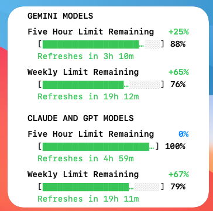

# TokenPace

TokenPace is a native, headless macOS widget that monitors your Google Antigravity (Agy) quota and usage pace. It sits quietly on your desktop or Notification Center, tracking both your 5-hour and 7-day limits, visually warning you if your usage pace is overburning or safely conserving quota.

*Note: TokenPace is an independent open-source project and is not affiliated with, endorsed by, or sponsored by Google. Google, Antigravity, and Agy are trademarks of their respective owners.*



## Features

- **Dual Group Tracking:** Independently tracks both the "Gemini Models" group and "Claude and GPT Models" group.
- **Multiple Timeframes:** Monitors the weekly (7-day) and five-hour remaining quota reported by Agy.
- **Pacing Indicator:** Quantifies your consumption rate versus an ideal linear burn, showing a percentage of underutilization or overburn.
  - 🟢 **Conserving:** (Green) Rounded deviation is above +2 percentage points.
  - 🔵 **On Track:** (Blue) Rounded deviation is within ±2 percentage points.
  - 🔴 **Overburn:** (Red) Rounded deviation is below −2 percentage points.
- **Reset Refreshes:** Schedules a quota read one minute after a reported reset, subject to connectivity, retry backoff and any running read.
- **Invisible Daemon:** Runs entirely in the background. No Dock icon, no Menu Bar clutter.


## Validation status

[Issue #2: quota freshness and recovery after network interruptions](https://github.com/Citizenyolo/TokenPace/issues/2) was accepted and closed on **2026-10-09** after the installed build `c8691cbf4168` passed an offline/reconnection test and usage/pacing comparison with CodexBar. The automated suite passes 86 regression checks plus daemon/widget typechecks. See the [validation report and repeatable test protocol](docs/validation/issue-2.md) for evidence, acceptance criteria and remaining limitations. [v1.1.2](https://github.com/Citizenyolo/TokenPace/releases/tag/v1.1.2) distributes this fix as source; no prebuilt or notarized app is included.

## How it works

TokenPace is split into two components: an invisible macOS application (the daemon) and a WidgetKit Extension.

1. **Detection:** The daemon watches `~/.gemini/antigravity-cli/conversations` and `~/.gemini/antigravity-ide/conversations` for filesystem write notifications. These are activity hints; TokenPace does not inspect conversation content or determine whether an answer has completed.
2. **Quota Fetching:** Startup, periodic, debounced activity, reset and connectivity-recovery triggers share one coordinator, which invokes your locally installed `~/.local/bin/agy --output-format json -p /usage`. TokenPace delegates quota retrieval to the authenticated Agy CLI.
3. **Sandbox Handoff:** Apple strictly limits WidgetKit apps unless you possess a paid Developer Account. To allow free compilation and installation, TokenPace uses an unsandboxed helper daemon that writes the fetched JSON directly into the Widget Extension's secure sandbox (`~/Library/Containers/<BundleID>Extension/Data/Documents/quota.json`), and then triggers a timeline reload.
4. **Widget Timelines:** The widget generates 120 minute-by-minute entries plus exact freshness/reset transitions. This lets the "Resets in Xh Ym" text count down without fetching quota for each redraw, subject to WidgetKit scheduling.
5. **Stale Cache Detection:** A successful, complete CLI read records `fetchedAt`. At 300 seconds old (or any expired reset), the widget labels the last known percentages "Data stale" and hides pacing indicators. Missing/future fetch timestamps cannot establish freshness. Malformed, partial, out-of-range or implausible-reset payloads are rejected; no reset fabricates 100% availability. Exact age/reset transitions are included in the timeline, subject to WidgetKit scheduling. This measures local read age, not guaranteed upstream freshness.

## Burn-rate / pacing calculation

TokenPace computes your burn rate mathematically inside the widget UI without requiring historical databases.

```swift
// Pseudocode
ideal_remaining = 1.0 - (time_elapsed / total_cycle_duration)
deviation = actual_remaining_fraction - ideal_remaining
displayed_deviation = round(deviation * 100)
```

- If `displayed_deviation > +2`: Conserving (+X% Green)
- If `displayed_deviation < -2`: Overburn (-X% Red)
- Otherwise: On Track (±X% Blue)

This is a comparison with a linear allowance, not a measured tokens-per-minute rate or a prediction based on usage history. Pacing is hidden when the snapshot is stale.

## Refresh Behavior

| Event | Quota/API fetch? | Widget Update? |
| :--- | :--- | :--- |
| CLI/IDE conversation-directory write notification | Requests a read after 3-second debounce, subject to backoff and single-flight coordination | On successful publication |
| Minute passes | No | Yes (Advances Timeline) |
| Cycle Reset Timestamp Reached | No | Yes (Data stale) |
| Reset + 60 seconds | Yes (Scheduled Timer) | Yes (Authoritative Sync) |
| Application Startup | Yes (idempotent, single-flight) | On successful publication |
| 240 seconds after successful publication | Yes | On successful publication |
| Failed read or publication | Retry after 10, 20, 40, 80, 160, then 300 seconds indefinitely | Retains last known data; ages into stale |
| No usable network path | No new CLI invocation | Retains last known data; ages into stale |
| Usable network path restored | One immediate attempt, without waiting for pending retry | On successful publication |
| Last successful read + 300 seconds | No | Data stale; no pacing indicator |

The 240-second cadence leaves a 60-second margin before the 300-second stale boundary, including a bounded 30-second CLI invocation. Periodic, debounced activity and reset triggers share one coordinator; none bypass failure backoff or overlap a running read. An `NWPathMonitor` pauses new reads when no usable path exists and requests one fresh read on recovery. Identical path notifications cannot bypass backoff. A response that spans a path loss is discarded; the coordinator waits for that invocation to finish before starting its replacement. A usable network path does not guarantee that the upstream service is reachable, so service failures still use backoff. Shutdown invalidates pending work and late responses. Reads also cap stdout at 1 MiB and require a zero exit status plus a `SUCCESS` envelope for the `usage` command. Widget reload occurs only after atomic `quota.json` publication succeeds. Existing legacy cache files decode but are not considered fresh without `fetchedAt`.

### Build identity for runtime acceptance

`install.sh` passes the source commit to both targets through `TOKENPACE_SOURCE_REVISION` (with a `-dirty` suffix for modified or untracked build inputs). The widget footer displays its own revision and the revision of the daemon that published the data. This distinguishes an old WidgetKit snapshot from a corrected build; inspecting only the app on disk is insufficient. Manual builds can pass `TOKENPACE_SOURCE_REVISION=<commit>` to `xcodebuild`. Unstamped builds display `unversioned` and cannot establish source identity.

### Reset countdown interpretation

Reset timestamps are copied from the successful Agy CLI response; TokenPace does not invent or extend them. Between reads, the widget counts down against the stored timestamp. A later CLI response can provide a later timestamp, so a five-hour countdown can move back toward five hours even without usage. This was observed at full reported availability during acceptance, and CodexBar also displayed approximately five hours. Exact backend window semantics remain unverified. Weekly countdowns decreased normally in the same test. See the [reset observations](docs/validation/issue-2.md#reset-countdown-observations).

### Isolated regression checks

Run `bash test_quota.sh` on macOS with Swift installed. This compiles production parsing, freshness, scheduling, subprocess and atomic file-store code against deterministic fixtures, an injected clock and temporary fake CLI executables; it also typechecks the daemon and widget. It never invokes the installed Agy CLI, accesses live quota files, installs/restarts the app, or changes connectivity. Covered cases include offline aging/recovery to actual fractions, reset/event/poll/retry coordination, publication failure, idempotent startup/shutdown, late responses, malformed/partial payloads and bounded subprocess failures. Run `bash test_install_staging.sh` separately to verify installer staging against temporary fixtures without installing the app.

These checks also run automatically for pull requests targeting `main` and pushes to `main` through the [GitHub Actions macOS workflow](.github/workflows/macos-ci.yml). It uses a standard GitHub-hosted runner, tests fixture data without calling the live Agy service, and currently reports results without blocking merges.

## Requirements

- macOS 14.0 (Sonoma) or newer. Apple Silicon & Intel supported.
- Xcode Command Line Tools installed.
- [XcodeGen](https://github.com/yonaskolb/XcodeGen) (`brew install xcodegen`).
- Google Antigravity / Agy CLI installed and authenticated at `~/.local/bin/agy`.

## Installation

### Quick Install

Simply run the provided bash script to generate the Xcode project, compile the binaries, perform ad-hoc code signing, and register the widget.

```bash
./install.sh
```

### Manual Install

If you prefer to inspect the process:
1. `xcodegen generate`
2. Open `TokenPace.xcodeproj` in Xcode.
3. Build the `TokenPace` scheme.
4. Apply the entitlements using `codesign --force --sign - --entitlements Entitlements.entitlements /path/to/app`.
5. Copy to `~/Applications` and run `lsregister -f` on the `.app`.

## Uninstall

To completely remove TokenPace:
```bash
set -e

# 1. Unload the daemon by service identity
SERVICE_TARGET="gui/$(id -u)/io.github.citizenyolo.TokenPaceDaemon"
if launchctl print "$SERVICE_TARGET" &>/dev/null; then
    launchctl bootout "$SERVICE_TARGET"
fi

# 2. Remove the LaunchAgent plist
rm -f ~/Library/LaunchAgents/io.github.citizenyolo.TokenPaceDaemon.plist

# 3. Ensure all processes are fully stopped
killall TokenPace 2>/dev/null || true
killall TokenPaceExtension 2>/dev/null || true

# 4. Delete the application
rm -rf ~/Applications/TokenPace.app

# 5. (Optional) Remove the widget sandbox data (contains cached quota.json)
# rm -rf ~/Library/Containers/io.github.citizenyolo.TokenPaceExtension
```

## Privacy & Security

TokenPace respects your privacy and is completely local.
- **What it watches:** It uses `DispatchSourceFileSystemObject` for write notifications on Antigravity conversation directories.
- **What it reads:** It never reads your conversation content. It only invokes `agy --output-format json -p /usage`.
- **What it stores:** A local `quota.json` containing quota fractions, reported reset timestamps, successful local read time (`fetchedAt`) and the publishing build revision. Copies are written to the host and widget container Documents directories.
- **Network access:** TokenPace itself makes zero network requests. Quota checks are routed exclusively through your authenticated local Agy CLI binary.

## Limitations

- **Timeline Precision:** Apple's WidgetKit independently controls timeline redraw budgets and scheduling logic. Therefore, widget updates and countdown changes are not guaranteed to occur at exact minute boundaries, and updates may be deferred based on system power or performance conditions.
- **Path Dependency:** Assumes `agy` is installed at `~/.local/bin/agy`.
- **Reset Semantics:** Countdown correctness depends on the timestamps returned by Agy. New responses may move a reset forward; TokenPace cannot establish the backend's window semantics from those responses alone.
- **Upstream Cache:** `fetchedAt` is local completion time, not a server-supplied observation timestamp. Agy CLI 1.3.1 failed with an `ERROR` envelope and no quota when outbound internet was denied while localhost remained allowed, both before and after a successful online `/usage` read (2026-10-07). This supports offline detection for that installed version; it does not establish every backend caching condition or future CLI behavior. The macOS network-path guard also prevents offline successful responses from renewing quota freshness.
- **API Stability:** Relies on the internal JSON structure of `agy /usage`. Changes by Google could break parsing.

## License

MIT License. See LICENSE file.
